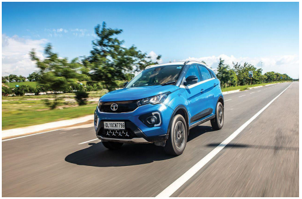
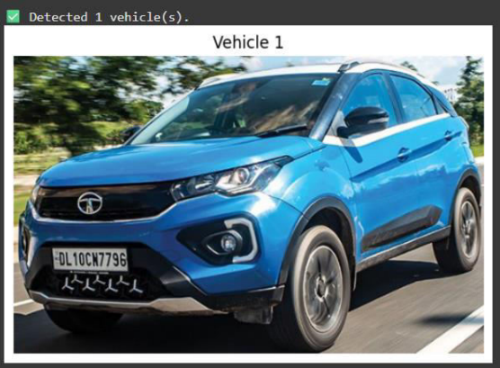
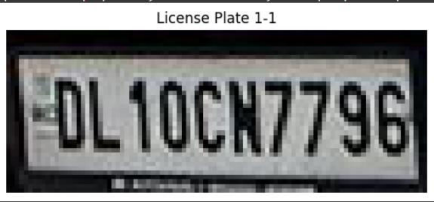

# Automatic Number Plate Detection for Indian Vehicles using YOLOv8

This project implements a two-stage vehicle and license plate detection pipeline designed specifically for Indian vehicles. It leverages the YOLOv8 object detection framework to address challenges posed by non-standardized license plate formats commonly seen across India. The system is intended for applications such as traffic monitoring, automated toll collection, and surveillance.

---

## Pipeline Overview

The detection pipeline is divided into two stages:

1. **Vehicle Detection**: Identifies and localizes vehicles (cars, bikes, trucks, and buses) using a pretrained YOLOv8 model.
2. **Number Plate Detection**: Processes the cropped vehicle images to identify and extract license plates using a custom-trained YOLOv8 model.

### Sample Output

| Description        | Image |
|--------------------|-------|
| Original Input     |  |
| Cropped Vehicle    |  |
| Cropped Number Plate |  |

---

## Model Details

- **Vehicle Detection Model**: YOLOv8n pretrained on the COCO dataset.
- **Number Plate Detection Model**: YOLOv8 trained on a subset of the Large License Plate Dataset and custom annotated images.
- **Performance**: Achieved approximately 94.5% accuracy over a test set of 10,000 images with `.xml` annotations.

---

## Getting Started
## Repository Structure


```bash
git clone https://github.com/yourusername/indian-anpr-yolov8.git
cd indian-anpr-yolov8
pip install -r requirements.txt
python inference_pipeline.py --image data/sample_images/step1_original.png
.
├── inference_pipeline.py
├── pipeline_demo.ipynb
├── requirements.txt
├── yolov8_plate_detect/
│   └── model_weights/
│       └── Lavanya_NamePlateModel.pt
├── data/
│   └── sample_images/
│       ├── step1_original.png
│       ├── step2_cropped_vehicle.png
│       └── step3_cropped_numberPlate.png
├── outputs/
│   ├── cropped_vehicles/
│   └── cropped_plates/
Dataset Sources and Attribution
Large License Plate Dataset – KaggleHub

Manually collected and annotated Indian vehicle images

Ultralytics YOLOv8 Repository

Future Improvements
Add OCR module to extract alphanumeric content from detected plates

Extend support for live video streams or webcam feeds

Improve robustness under poor lighting and varied angles
License
This project is licensed under the MIT License.

Author
Lavanya Shree
Developed at the Centre for Development of Telematics (C-DOT), New Delhi.


